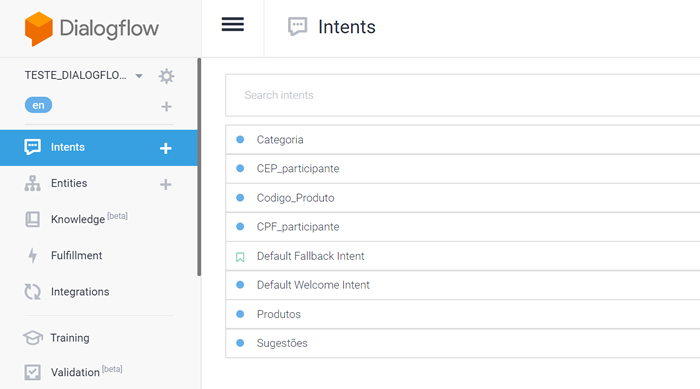

# BOT Catalogo Produtos

Este é o backend que envia informações para um agent de chat criado na plataforma DialogFlow.

Ele serve para responder perguntas sobre produtos de um catálogo de prêmios. Existe uma base de dados fixa para consulta.

O chatbot é consumido através de uma aplicação React Native, que pode ser visto neste link:

https://github.com/dbins/bot_catalogo_aplicativo.git

A API pode ser acessada a partir deste endereço:

https://bot-catalogo.herokuapp.com/

## Instalação

- git clone https://github.com/dbins/bot_catalogo.git
- npm install
- npm start

## Rotas da API

Abaixo segue um resumo das rotas disponíveis:

| Rota             | Método | Descrição                                                                      |
| ---------------- | ------ | ------------------------------------------------------------------------------ |
| /dialog          | POST   | Recebe informações enviadas pelo DialogFlow e devolve resposta para o servidor |
| /sugestao        | GET    | Lista um produto aleatório                                                     |
| /CPF/:cpf        | GET    | Valida se o CPF informado é válido                                             |
| /CEP/:cep        | GET    | Retorna dados do CEP informado                                                 |
| /categoria/:nome | GET    | Exibe informações sobre a categoria de produto informada                       |
| /produto/:nome   | GET    | Pesquisa produto pelo nome                                                     |
| codigo_produto   | GET    | Pesquisa produto pelo código                                                   |
| reclamacao       | POST   | Envia uma reclamação por e-mail                                                |
